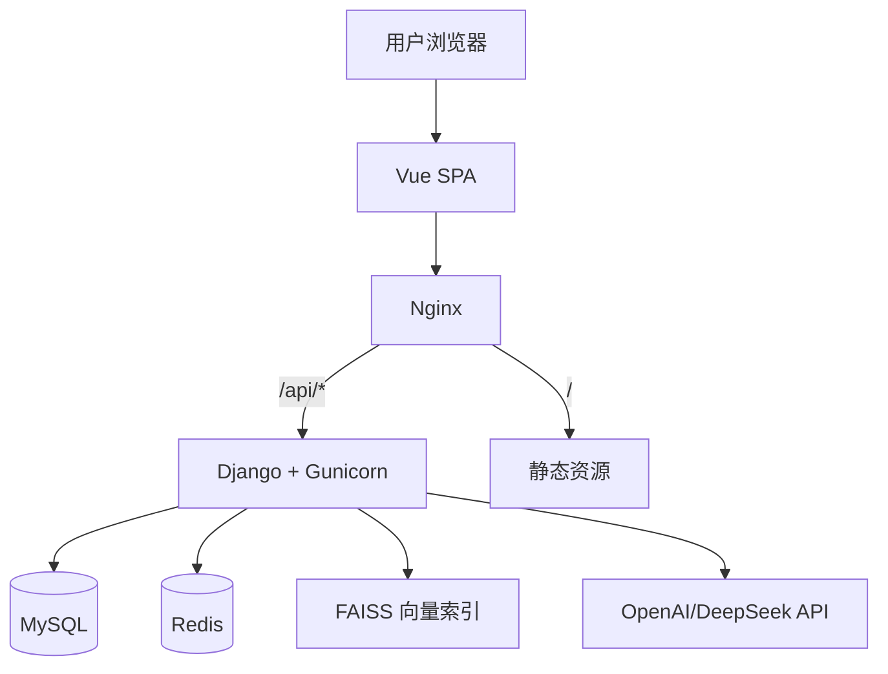

# Project Phoenix 2.0 完整项目说明书与技术知识点讲解

## 0. 文档定位

这份文档用于两个目标：

1. **面试表达**：你可以直接按文档中的“项目亮点、架构图、难点与权衡、Q&A 模板”来讲述项目。
2. **系统学习**：你可以按文档中的“技术知识点与实践路径”复盘 Django、DRF、RAG、Docker 等关键能力。

---

## 1. 项目背景与目标

### 1.1 背景

你从 Django/DRF 路线切入后端开发，当前岗位市场中 AI Agent 工程岗位占比上升。为了让简历更具竞争力，你需要一个既能体现工程能力、又能体现 AI 应用能力的项目。

### 1.2 项目目标

- **产品目标**：做一个从岗位分析 -> 简历优化 -> 模拟面试的完整闭环。
- **工程目标**：做到可运行、可扩展、可容器化部署，且有清晰模块边界。
- **面试目标**：展示全栈工程、AI 集成、系统设计、运维部署的综合能力。

---

## 2. 已交付功能（当前版本）

### 2.1 功能闭环

1. **岗位分析（JD Analysis）**
- 输入岗位描述（JD）
- Agent 提取关键词/职责/要求
- 调用 LLM 生成岗位能力分析
- 保存会话与结构化结果

2. **简历优化（Resume Optimization）**
- 读取用户最近 JD 分析结果
- 对比简历文本与 JD 关键词
- 输出匹配度、缺失点和改写建议
- 保存结构化优化结果

3. **模拟面试（Mock Interview）**
- 基于题库 + 向量检索（FAISS）召回问题
- 结合用户回答做追问和反馈
- 支持多轮会话，结果持久化

### 2.2 工程能力亮点

- 前后端分离（Vue SPA + Django API）
- Agent 分层（Orchestration / Skill / Tool）
- RAG 检索（Markdown -> Embedding -> FAISS）
- Redis 缓存（RAG、LLM、会话）
- Docker Compose 一键部署（MySQL、Redis、Backend、Nginx）

---

## 3. 技术栈与版本说明

- 前端：Vue 3 + Vite + Axios
- 后端：Django 4.2 + DRF
- 数据库：MySQL 8
- 缓存：Redis 6
- 向量检索：FAISS CPU
- 嵌入模型：Sentence-Transformers（默认 `all-MiniLM-L6-v2`）
- LLM：OpenAI / DeepSeek（可切换）
- 部署：Docker + Docker Compose + Nginx + Gunicorn

> 兼容性策略：如果未配置 LLM API Key，系统自动进入离线回退模式，保证流程可运行。

---

## 4. 系统架构设计

### 4.1 C4-L2 视角



### 4.2 分层说明

- **API 层（apps/api）**：参数校验、会话创建、错误处理、响应封装。
- **编排层（apps/agent_engine/agent.py）**：统一路由到不同 Skill。
- **能力层（skills + tools）**：
  - Skill：业务能力单元（JD/Resume/Interview）
  - Tool：基础能力（LLM 客户端、文本处理、向量检索）
- **数据层（apps/core + MySQL/Redis/FAISS）**：持久化、缓存、索引文件。

---

## 5. 代码结构与职责

```text
backend/
  manage.py
  requirements.txt
  Dockerfile
  entrypoint.sh
  phoenix_project/
    settings.py
    urls.py
    wsgi.py
  apps/
    core/
      models.py
      migrations/
    api/
      serializers.py
      views.py
      urls.py
    agent_engine/
      agent.py
      skills/
        jd_analyzer.py
        resume_optimizer.py
        mock_interviewer.py
      tools/
        llm_client.py
        text_tools.py
        rag_store.py
  data/
    interview_questions.md
    vector_store/
  scripts/
    wait_for_db.py
    build_vector_store.py

frontend/
  src/App.vue
  src/main.js
  src/style.css
  Dockerfile
  nginx.conf

docker-compose.yml
.env.example
README.md
```

---

## 6. 数据模型设计（Django Models）

### 6.1 ChatSession

- 字段：`user`, `topic`, `created_at`
- 作用：表示一次完整会话（JD 分析会话、模拟面试会话等）

### 6.2 ChatMessage

- 字段：`session`, `role`, `content`, `metadata`, `created_at`
- 作用：保存每轮对话消息，`metadata` 保存结构化辅助信息

### 6.3 AnalysisResult

- 字段：`user`, `source_type`, `source_text`, `structured_data`, `created_at`
- 作用：保存分析结果快照，便于后续查询与复用

### 6.4 为什么这么设计

- 会话与消息拆分，便于多轮对话查询与统计
- 分析结果独立存储，便于构建“分析历史”与“对比演进”功能
- `JSONField` 让结构化输出可扩展，后续无需频繁改表

---

## 7. API 设计与调用流程

Base URL：`/api/v1`

### 7.1 `POST /jd/analyze`

请求：

```json
{
  "username": "demo_user",
  "jd_text": "..."
}
```

响应：

```json
{
  "session_id": 123,
  "message": {
    "role": "assistant",
    "content": "...",
    "metadata": {
      "jd_keywords": [],
      "must_have_skills": [],
      "nice_to_have_skills": [],
      "responsibilities": []
    }
  }
}
```

### 7.2 `POST /resume/optimize`

请求：

```json
{
  "username": "demo_user",
  "session_id": 123,
  "resume_text": "..."
}
```

响应包含：匹配关键词、缺失关键词、匹配度分数和优化建议。

### 7.3 `POST /interview/chat`

开始新会话：

```json
{
  "username": "demo_user",
  "topic": "Python后端"
}
```

继续对话：

```json
{
  "username": "demo_user",
  "session_id": 456,
  "user_answer": "..."
}
```

### 7.4 `GET /health`

返回后端服务健康状态。

---

## 8. Agent 架构详解（面试重点）

### 8.1 编排思想

`PhoenixAgent` 不是“一个大 Prompt”，而是“路由器 + 能力注册器”：

- `analyze_jd()` -> `JDAnalyzerSkill`
- `optimize_resume()` -> `ResumeOptimizerSkill`
- `start_interview()/continue_interview()` -> `MockInterviewerSkill`

### 8.2 Skill 与 Tool 的职责划分

- Skill 负责业务流程编排（类似 UseCase）
- Tool 负责可复用原子能力（LLM、向量检索、关键词提取）

这种划分的价值：

- 减少重复代码
- 降低耦合，便于扩展新 Skill
- 单元测试粒度清晰

### 8.3 与传统“直接在 View 写逻辑”的区别

- View 只关注 HTTP 输入输出
- Agent/Skill 关注业务语义
- Tool 关注技术细节

这就是面试里常说的“分层 + 解耦 + 可演进”。

---

## 9. RAG 机制详解

### 9.1 数据来源

`backend/data/interview_questions.md` 作为初始题库。

### 9.2 索引构建

流程：

1. 读取 Markdown 题目
2. 文本嵌入（Sentence-Transformers）
3. 写入 FAISS 索引 `index.faiss`
4. 保存文档元数据 `index_meta.json`

### 9.3 检索流程

1. 用户输入 topic（如 Python后端）
2. 向量化 query
3. FAISS Top-K 检索
4. 返回问题池
5. Skill 基于问题池进行追问

### 9.4 回退策略

- FAISS 不可用 -> 使用 NumPy 余弦相似度回退
- Sentence-Transformers 不可用 -> 哈希嵌入回退

这样做的意义：在不完整依赖环境下仍可演示系统闭环。

---

## 10. 缓存策略（Redis）

### 10.1 RAG 缓存

- Key：`rag:topic:<topic>`
- Value：该 topic 的问题池
- TTL：`RAG_CACHE_SECONDS`（默认 3600s）

收益：减少重复向量检索开销。

### 10.2 LLM 缓存

- Key：`llm:<prompt_hash>`
- Value：模型返回文本
- TTL：`LLM_CACHE_SECONDS`（默认 600s）

收益：降低 API 成本和响应时延。

### 10.3 会话最近消息缓存

- Key：`session:<id>:recent`
- Value：最近 10 条消息
- TTL：`SESSION_CACHE_SECONDS`

收益：高频读取场景下减轻数据库压力。

---

## 11. Docker 部署说明

### 11.1 服务构成

- `db`：MySQL 8
- `redis`：Redis 6
- `backend`：Django + Gunicorn
- `nginx`：前端静态资源 + API 反向代理

### 11.2 启动链路

`backend/entrypoint.sh` 执行顺序：

1. `wait_for_db.py` 等待 MySQL/Redis
2. `python manage.py migrate`
3. `python scripts/build_vector_store.py`
4. `python manage.py collectstatic`
5. `gunicorn ...`

### 11.3 一键启动

```bash
cp .env.example .env
docker compose up --build
```

### 11.4 常见问题

1. Docker daemon 未启动
- 错误表现：`dockerDesktopLinuxEngine ... cannot find the file`
- 解决：先启动 Docker Desktop 再执行 compose 命令

2. 模型下载慢
- Sentence-Transformers 初次下载较慢
- 生产建议：预拉取模型或挂载缓存目录

3. 没有 API Key
- 系统会走离线回退模式，可正常演示流程

---

## 12. 前端说明（Vue）

### 12.1 页面结构

单页 3 个主模块：

- 岗位分析
- 简历优化
- 模拟面试

### 12.2 状态管理

采用组件内 `ref` 管理（项目规模当前足够）。

### 12.3 通信方式

Axios 统一请求 `/api/v1`，Nginx 反代后避免跨域复杂度。

---

## 13. 安全与工程规范（当前版本 + 可优化项）

### 13.1 当前已有

- 环境变量管理（`.env`）
- 数据持久化（MySQL + volume）
- 基础错误处理（参数校验、404、服务异常回退）

### 13.2 下一步建议

- 引入 JWT 鉴权与 RBAC
- 接口限流（DRF Throttling）
- OpenTelemetry + Prometheus + Grafana
- Celery 异步任务队列
- CI/CD（lint + test + build + deploy）

---

## 14. 面试讲解模板（可直接背）

### 14.1 60 秒项目介绍

“我做了一个 AI 面试助手，核心是 Agent 化求职闭环：JD 分析、简历优化、模拟面试。后端用 Django/DRF，前端 Vue，数据层是 MySQL+Redis，知识检索用 Sentence-Transformers + FAISS，部署用 Docker Compose。架构上我把系统拆成 API 层、Agent 编排层和 Skill/Tool 能力层，保证可维护与可扩展。项目支持 LLM Key 缺失时的离线回退模式，保证演示稳定。”

### 14.2 你做的最有价值设计

- Skill/Tool 分层，降低业务逻辑耦合
- RAG 缓存 + LLM 缓存，兼顾时延与成本
- 容器化一键部署，提升可复现性

### 14.3 遇到的技术挑战

- LLM/API 与本地环境不稳定：通过缓存和回退策略保证可用
- 向量索引初始化时机：通过启动脚本自动构建索引
- 多服务协同启动：通过 healthcheck + wait 脚本解决依赖顺序

### 14.4 如果你再迭代两周

- 增加用户认证与个人面试报告
- 增加评分维度（表达、深度、结构、业务理解）
- 增加管理后台（题库管理、会话回放、成本看板）

---

## 15. 技术知识点讲解（面试高频）

### 15.1 Django + DRF

1. Django 适合快速构建中后台与 API 服务，ORM 能快速落地数据模型。
2. DRF 提供序列化、校验、权限、限流等标准能力，适合 API 工程化。
3. `APIView` 与 `Serializer` 组合，天然形成“输入校验 -> 业务逻辑 -> 输出响应”闭环。

### 15.2 MySQL

1. 关系型数据库适合结构化会话数据与用户数据。
2. 性能关键在索引、慢查询分析和连接池参数。
3. 面试常问：联合索引最左前缀、回表、覆盖索引、事务隔离级别。

### 15.3 Redis

1. 高速缓存用于热点数据与短时计算结果。
2. 常见问题：缓存击穿/穿透/雪崩。
3. 常见策略：互斥锁、布隆过滤器、随机过期时间、热点预热。

### 15.4 FAISS + Embedding

1. Embedding 把文本映射到向量空间。
2. FAISS 做近似或精确向量检索（本项目使用 CPU 版，IndexFlatIP）。
3. RAG 关键不只是“检索”，而是“检索质量 + 上下文组织 + 生成约束”。

### 15.5 Agent 思维

1. Agent 不等于单次大模型调用。
2. 工程上应拆分为：意图路由、技能编排、工具调用、结果缓存、状态管理。
3. 项目中 PhoenixAgent 体现了“可组合能力”的思想。

### 15.6 Docker / Compose

1. 统一运行时环境，避免“我本地能跑”问题。
2. Compose 将多服务协同定义为代码。
3. 部署可复现是工程能力的重要信号。

### 15.7 Nginx

1. 前端静态资源托管
2. `/api` 反向代理后端
3. 能统一入口、减少 CORS 成本、便于后续接入 HTTPS

---

## 16. 可扩展路线图（给面试官看的“成长性”）

### 短期（1-2 周）

- JWT 鉴权与用户体系
- 会话列表与历史回放
- 基础测试覆盖（API 单测 + Skill 单测）

### 中期（1 个月）

- Celery 异步任务（批量解析简历、离线题库更新）
- 面试评分模型与报告导出
- 多模型路由（根据任务类型切换模型）

### 长期（2-3 个月）

- 多租户 SaaS 化
- 观测与成本治理平台
- 企业级权限与审计日志

---

## 17. 你在面试中可强调的“个人贡献”句式

1. “我主导了 Agent 分层设计，避免业务逻辑堆积在 View 层。”
2. “我实现了 RAG 索引构建脚本和启动自动化流程，降低了环境准备成本。”
3. “我做了 Redis 缓存策略，把重复检索和重复生成的耗时降下来了。”
4. “我将系统容器化，保证开发、测试、演示环境一致。”

---

## 18. 本项目与原计划书的差异说明

为保证“可运行优先”，做了以下工程化调整：

1. **认证方式简化**
- 当前通过 `username`/`X-User` 做轻量隔离，未上完整注册登录流程。
- 好处：快速落地可演示闭环。
- 后续：可直接加 JWT。

2. **Agent 框架采用轻量自研编排**
- 保留了 LangChain/LlamaIndex 依赖入口，但当前主流程使用自研 Skill/Tool 以降低复杂度与调试成本。

3. **LLM 与 Embedding 的回退机制**
- 保证在无 Key 或模型加载失败时项目仍可运行。

---

## 19. 验收清单（你可以用于自测）

1. `docker compose up --build` 可拉起 4 个服务
2. 访问前端页面可看到三大功能区
3. JD 分析接口可返回结构化 metadata
4. 简历优化接口可返回匹配度和建议
5. 模拟面试可进行至少 3 轮问答
6. MySQL 中可看到会话和消息记录
7. Redis 中可看到 `rag:topic:*` 和 `llm:*` 缓存键

---

## 20. 附录：关键启动命令

```bash
# 1) 配置环境
cp .env.example .env

# 2) 启动
Docker compose up --build

# 3) 停止
docker compose down

# 4) 清理并重建
docker compose down -v
docker compose up --build
```

> 如果你在 Windows 上运行，先确认 Docker Desktop 已启动。

---

## 21. 结语

这个项目已经满足“可运行 + 可讲述 + 可拓展”的求职样板目标。你在面试中重点突出三件事：

1. 你能完成完整业务闭环，不是只会单点 API。
2. 你有工程化意识（分层、缓存、容器化、回退策略）。
3. 你理解 AI 工程本质是“模型能力 + 系统能力”的结合。